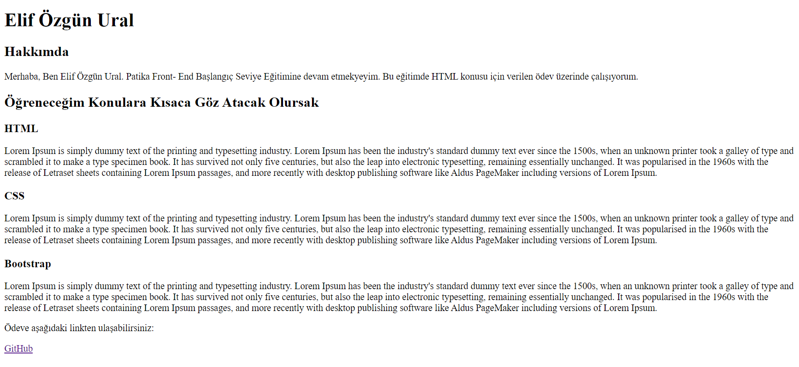

# HTML Ödev 1

Bu repo [Kodluyoruz](https://www.kodluyoruz.org/) Front-End Eğitim içeriğinin HTML konusunun ilk ödevidir. 

Proje içerik olarak;

REDAME.md

index.html dosyalarını barındırıyor.

# Installation

Öncelikle projeyi klonlayın. 

[https://github.com/elifzgnrl/kodluyoruz-odev2](https://github.com/elifzgnrl/kodluyoruz-odev2)
  
# Usage
Projeyi klonladıktan sonra Visual Studio Code programında açınız.

Linux için:

cd kodluyoruz-odev2

code .

# Contribution
Pull requestler kabul edilir. Büyük değişiklikler için, lütfen önce neyi değiştirmek istediğinizi tartışmak için bir konu açınız.

# License
[MIT](https://choosealicense.com/licenses/mit/)
